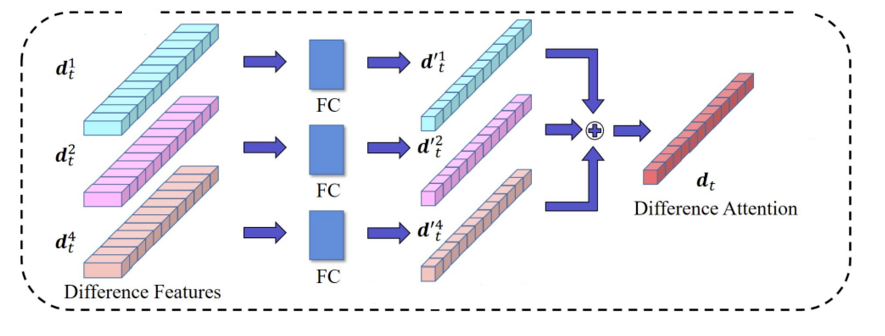

# SADNet
Self and Difference Attention Network for Video Summarization

## SADNet Architecture overview

  

 

## Datasets and pretrained models

Preprocessed datasets TVSum, SumMe, YouTube and OVP as well as VASNet pretrained models you can download by running the following command:

    ./download.sh datasets_models_urls.txt

Datasets will be stored in ./datasets directory and models, with corresponding split files, in ./data/models and ./data/splits respectively.

Original version of the datasets can be downloaded from http://www.eecs.qmul.ac.uk/~kz303/vsumm-reinforce/datasets.tar.gz or https://www.dropbox.com/s/ynl4jsa2mxohs16/data.zip?dl=0.

## Training

To train the SADNet on all split files in the ./splits directory run this command:

    python3 main.py --train

Results, including a copy of the split and python files, will be stored in ./data directory. You can specify different directory with a parameter -o <directory_name>.

The final results will be recorded in ./data/results.txt with corresponding models in the ./data/models directory.

By default, the training is done with split files in ./splits directory.

## Acknowledgement

I would like to thank to [K. Zhou et al.](https://github.com/KaiyangZhou/pytorch-vsumm-reinforce) and [K Zhang et al.](https://github.com/azhar0100/VASNet/blob/master) for making the preprocessed datasets publicly available and also [Jiri Fajtl et al.]() for the most of the VASNet code which I copied from https://github.com/ok1zjf/VASNet and modified according to the new Network architecture.

## References

    @misc{fajtl2018summarizing,
        title={Summarizing Videos with Attention},
        author={Jiri Fajtl and Hajar Sadeghi Sokeh and Vasileios Argyriou and Dorothy Monekosso and Paolo Remagnino},
        year={2018},
        eprint={1812.01969},
        archivePrefix={arXiv},
        primaryClass={cs.CV}
    }

    @article{DBLP:journals/corr/abs-1811-09791,
      author    = {Yunjae Jung and Donghyeon Cho and Dahun Kim and Sanghyun Woo and In So Kweon},
      title     = {Discriminative Feature Learning for Unsupervised Video Summarization},
      volume    = {abs/1811.09791},
      year      = {2018},
      url       = {http://arxiv.org/abs/1811.09791},
      archivePrefix = {arXiv},
      eprint    = {1811.09791},
    }
